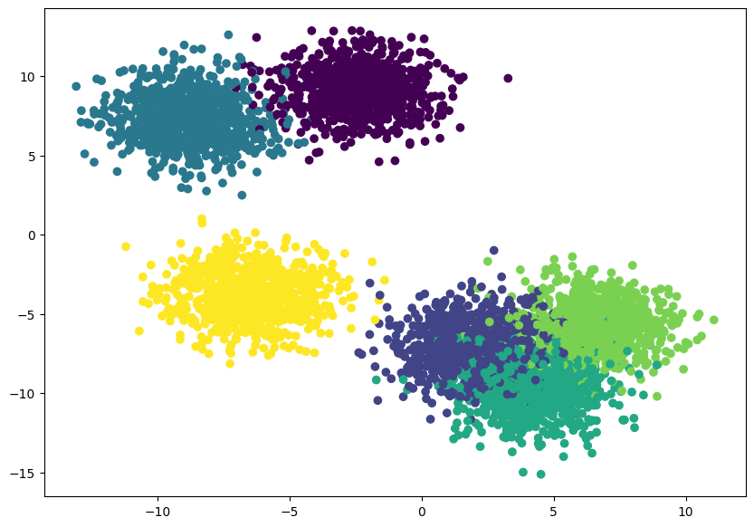
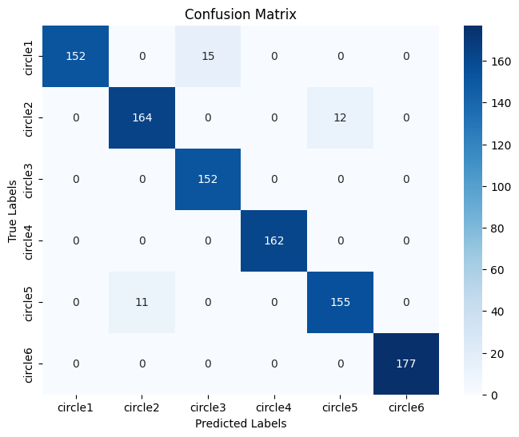

# Multi-Class Classification using PyTorch

## Dataset

We are using the `make_blobs` dataset from `sklearn`. The dataset parameters were:

| **Attribute**               | **Value** |
|-----------------------------|-----------|
| Number of samples            | 5000      |
| Number of classes            | 6         |
| Number of features           | 3         |
| Cluster standard deviation   | 1.5       |

### Dataset Visualization

## Train test Size
### the train test split was with these parameters:

| **Attribute**               | **Value** |
|-----------------------------|-----------|
| Train Size                  | 0.8       |
| Test Size                   | 0.2       |

## Model Architecture
The model architecture was a basice ANN model

The model consisted of:
- **3 Linear Layers**
- **2 Non-Linear function(Relu)**

## Training Hyperparameters

| **Hyperparameters**               | **Value** |
|-----------------------------|-----------|
| Epochs                  | 200       |
| Learning Rate                   | 0.02       |
| Optimizer                   | SGD       |
| Loss Function                   | CrossEntropy       |
| Activation function                   | Argmax       |

## Performance Metrics

| **Metric**               | **Performance Value** |
|-----------------------------|-----------|
| Accuracy                  | 0.96       |
| Train Loss                  | 0.243       |
| Test Accuracy                  | 0.95       |
| Test Loss                  | 0.249       |

### Confusion Matrix
